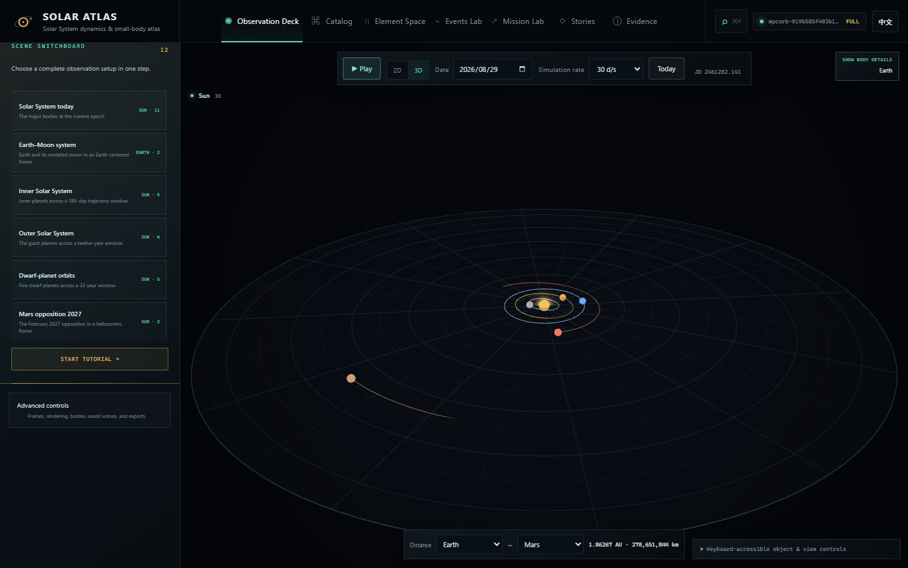

# Solar Atlas / 太阳系图谱

**浏览器原生的太阳系动力学与小天体图谱：场景可复现、数据可追溯、模型边界明确。**

[](https://github.com/dajiaohuang/solar/actions/workflows/deploy.yml) [](https://github.com/dajiaohuang/solar/actions/workflows/mobile.yml)

[打开 Solar Atlas](https://dajiaohuang.github.io/solar/) · [English](./README.md) · [移动端构建](./MOBILE-CN.md) · [隐私说明](./PRIVACY-CN.md) · [科学模型与边界](#科学模型与边界) · [参与贡献](#参与贡献)

应用版本：**v0.11.0** · [线上构建身份](https://dajiaohuang.github.io/solar/health.json) · [更新日志](./CHANGELOG.md) · [路线图](./ROADMAP.md) · [性能预算](./PERFORMANCE.md)

> **从这里开始：** [直接打开综合观测台](https://dajiaohuang.github.io/solar/)。根网址就是应用本身，前面没有宣传页，也无需账号登录。



Solar Atlas 把空间工作台、轨道元素空间、事件分析、任务几何、引导课程和数据证据连接到同一个纯前端应用。它面向探索与教学，**不是**业务星历、碰撞预警服务、N 体积分器或航天导航产品。

## 几秒钟开始体验

| 目标 | 最短路径 |
| --- | --- |
| 立即探索 | [打开综合观测台](https://dajiaohuang.github.io/solar/)，选择“**直接探索**” |
| 学习操作 | 打开同一网址，选择“**进入教程**”；四步教程之后可从预设面板再次打开 |
| 体验可复现课程 | [解释火星逆行](https://dajiaohuang.github.io/solar/?v=4&page=stories&story=retrograde-mars&step=2&view=3d&lang=zh)，或在[可复现场景](#可复现场景)中选择其他入口 |
| 本地运行 Web 应用 | 依次运行 `npm ci` 与 `npm run dev`；内置核心不要求下载小行星数据集 |
| 查看原生验证 | 打开 [Android/iOS 工作流](https://github.com/dajiaohuang/solar/actions/workflows/mobile.yml)，或按 [MOBILE-CN.md](./MOBILE-CN.md) 中的平台命令操作 |

根网址会直接进入**综合观测台**，访客无需先经过宣传首页。

1. 初次访问时，综合观测台的轻量预览上会出现“进入教程”与“直接探索”选择；选择后才下载并初始化可交互的 Three.js 渲染器分块，避免在尚未操作的提示框后方提前执行昂贵的隐藏工作。
2. 四步短教程依次介绍视角操作、参考系、天体选择和预设场景。教程只自动显示一次，也可从预设区重新打开。
3. 预设场景列表默认展开；参考系、渲染、天体、场景库和导出等功能默认收在“高级控制”中，需要时再展开。

空间视图默认使用 **3D**，并可随时切换到批量绘制的二维黄道视图。若 3D WebGL 创建失败或上下文丢失，同一场景会自动回退到仍可操作的 2D 视图。

默认综合观测台只加载内置主要天体模型，**不会**下载小行星展示样本。只有进入目录或轨道元素空间、选择数据集驱动预设、恢复目录场景，或显式开启“目录点云”时，应用才请求目录数据。

## 内置预设场景

近卫星系统的 3D 相机、裁剪范围与示意标记大小会按场景尺度适配，并兼顾竖屏旋转。位置坐标仍使用 AU；放大的天体标记和环**不代表真实尺寸**。六个扩展卫星预设按最快的种子轨道周期缩短时间窗，使默认 180 点采样对最快卫星每圈至少约 24 点；较慢卫星可能只显示部分轨迹。手动延长时间窗或减少采样仍可能造成快速轨道欠采样，轨迹线是离散历史点而非拟合闭合椭圆。

详情与悬停读数在距离小于 0.01 AU 时使用千米，不满一天的周期使用小时。卫星的轨道极值称为相对于母天体的**近拱点/远拱点**；倾角基于 J2000 黄道面，而不是行星赤道。显示位数不代表误差范围。直接 SPK 地心位置与保留的地月质心推导回退模型会分别标注。

Solar Atlas 当前提供十九个一键预设，包括六个扩展的行星中心卫星系统和 16 颗大型小行星场景。每个预设都固定历元、参考系、聚焦集合、视图、缩放和轨迹窗口；数据集驱动预设还会固定完整的数据版本、样本和筛选组合。

| 预设 | 参考系与历元 | 默认视图 | 展示内容与声明边界 |
| --- | --- | --- | --- |
| 今日太阳系 | 太阳 · 当前日期 | 3D | 当前近似历元下的主要行星、月球、谷神星和冥王星 |
| 地月系统 | 地球 · 2026-07-01 | 3D | 已加载时使用 DE440s 地心/月心；否则使用明确标注的均值椭圆回退模型 |
| 内太阳系 | 太阳 · 2026-07-01 | 3D | 水星至火星及月球，轨迹窗口 180 天 |
| 外太阳系 | 太阳 · 2026-07-01 | 3D | 木星至海王星，轨迹窗口 12 年 |
| 矮行星轨道 | 太阳 · 2026-07-01 | 3D | 谷神星、冥王星、阋神星、妊神星和鸟神星，轨迹窗口 33 年 |
| 火星冲日 2027 | 太阳 · 2027-02-19 | 3D | 2027 年 2 月冲日前后的日心地球—火星—木星几何 |
| 木星与已建模伽利略卫星 | 木星 · 2026-07-01 | 3D | 木星及四颗伽利略卫星；已加载时使用 JUP365，否则回退固定椭圆 |
| 土星—泰坦系统 | 土星 · 2026-07-01 | 3D | 土星和土卫六，使用同一套有界卫星模型契约 |
| 火星—主带—木星 | 太阳 · 2026-07-01 | 轨道元素空间 / `a–e` | 固定 8,000 条展示样本中的 MBA 子集，并以火星、谷神星和木星作为日心地标；不是完整主带 |
| 主带轨道元素对比 | 太阳 · 2026-07-01 | 轨道元素空间 / `a–i` | 同一固定样本中的 MBA 子集，比较半长轴与倾角；不是完整主带 |
| 近地天体区域 | 太阳 · 2026-07-01 | 3D | 已准备好显式加入 NEO 的内太阳系聚焦集合 |
| 旅行者号时代 | 太阳 · 1980-01-01 | 3D | 1977–1989 年飞掠时期的近似外行星排列；航天器叠加仍是示意轨迹 |

预设列表会持续扩展。新增预设应保持一键进入、中英双语、URL 可回放，诚实区分样本与完整数据，并说明每个天体所用模型。

## 工作区

- **综合观测台**：二维/三维空间视图、有界模拟时钟、任意已加载天体参考系、分屏参考系对比、可搜索聚焦集合、轨迹和相机控制、测距、拉格朗日点、希尔球、拉普拉斯影响球及可选目录点云。
- **小天体目录**：不可变 MPCORB 发布、名称/编号/临时编号搜索、紧凑索引精确筛选、NEO/PHA 与轨道分类、有界 locator 回填，以及按数据版本隔离的 IndexedDB 缓存。
- **轨道元素空间**：`a–e`、`a–i`、`a–H`、`q–Q`、`a–周期` 联动图，共振与柯克伍德空隙、框选、键盘逐点检查、直方图和日心三维联动聚焦。
- **事件实验室**：显式启动且可取消的近距离、合、冲、近拱点与远拱点任务，包含自适应采样、局部细化曲线和采样充分性提示。
- **任务实验室**：方向正确的霍曼基线、相位角提示、强制残差收敛的通用变量 Lambert 解、出发/到达 `v∞`、C3 和可交互 Porkchop 图。
- **引导故事**：八门六阶段、观察优先的课程。核心课程专门区分历史地心说与现代地心参考系的使用。
- **对象图谱与证据**：五分区天体档案、来源链接、模型有效性、数据来源、构建身份、科学验证和发布证据。

使用 `Ctrl/⌘ K` 或 `/` 可全局搜索天体、故事和术语。浏览器前进/后退、双语页面标题、键盘场景控制、四按钮移动端导航和减少动态效果偏好均属于受支持界面。

## 可复现场景

场景 URL **v4** 会记录回放工作区所需的科学与交互状态：路由、不可变数据集版本、数据模式、历元、主/对比参考系、聚焦集合、筛选器、轨迹采样、视图模式、目录点云开关、3D 性能档位、元素图、引导课程步骤、任务端点/日期、语言和视图参数。

目录工作区和数据集驱动预设会把 `catalogSample=mobile|desktop` 与 manifest 声明的 `catalogSampleCount` 成对固定。字段不完整、版本不可用、档位不支持或数量不匹配时，样本加载会失败关闭。v2 和 v3 链接仍可读取，并在响应式样本解析后升级为 v4。场景还可保存在本地，并以带版本的 JSON 场景库导入或导出。

| 可复现保证 | 明确不保证 |
| --- | --- |
| 数据发布、样本档位/数量、筛选器、选择顺序、历元、参考系、视图和分析输入会进入 URL 或内容寻址产物 | 共享场景不承诺相同 FPS、GPU 吞吐或网络延迟 |
| 目录筛选与精确总数不受本机可见点预算影响 | “自动/最高”可能在不同设备或不同时刻绘制长度不同的确定性前缀 |
| 所选 3D 性能档位可以分享 | 当前自适应点数是运行时状态，刻意不写入 URL |
| 3D 自动构图与所设置的缩放会从规范起始相机回放 | 自由环绕、平移、滚轮和捏合手势仅保留在当前会话；“重置视图”会恢复可复现构图 |
| 模型身份、有效性提示和构建证据保持可见 | 外部 JPL SBDB 可用性和未缓存远程数据不由场景 URL 控制 |

可直接打开的可复现入口：

- [核心课程：地心说与地心参考系](https://dajiaohuang.github.io/solar/?v=4&page=stories&story=geocentric-model&view=3d&lang=zh)
- [解释火星逆行](https://dajiaohuang.github.io/solar/?v=4&page=stories&story=retrograde-mars&step=2&view=3d&lang=zh)
- [在元素空间观察柯克伍德空隙](https://dajiaohuang.github.io/solar/?v=4&page=stories&story=kirkwood-gaps&step=1&view=3d&lang=zh)
- [比较四类 NEO 轨道](https://dajiaohuang.github.io/solar/?v=4&page=stories&story=neo-types&view=3d&lang=zh)
- [检查冥王星—海王星 3:2 几何](https://dajiaohuang.github.io/solar/?v=4&page=stories&story=pluto-resonance&step=1&view=3d&lang=zh)
- [打开地球到火星任务设置](https://dajiaohuang.github.io/solar/?v=4&page=mission&from=earth&to=mars&depart=2026-11-15&arrive=2027-08-01&view=3d&lang=zh)

## 渲染与设备策略

Solar Atlas 把三个回答不同问题的上限分开处理：

1. **目录样本数量**：目录场景可以使用的不可变数据，目前移动端为 8,000 条、桌面端为 30,000 条。
2. **可见目录点预算**：在综合观测台显式开启“目录点云”后，本机实际绘制的确定性前缀长度。
3. **聚焦天体上限**：具有独立轨迹、交互和详情的天体数量，3D 为 160，批量绘制的 2D 为 320。

初始设备类别由视口宽度决定；横屏且使用粗指针的设备在宽度不超过 1,180 px 时仍采用移动端策略。浏览器可选提供的内存与并发数提示只能让自适应首帧更保守，不能把设备提升到更高类别；启动后以真实帧时间为准，两个渲染器都会限制设备像素比。分屏参考系对比在同一个总点预算内让两侧使用相同的确定性前缀。

| 视图与档位 | 移动端可见点 | 桌面端可见点 | 运行时行为 |
| --- | ---: | ---: | --- |
| 2D，任意档位 | 8,000 | 30,000 | 固定；WebGL 批量点绘制 |
| 3D 自动 | 标称初始 4,000；范围 2,000–6,000 | 标称初始 12,000；范围 6,000–20,000 | 连续慢帧后降低，只有持续留有余量才提高 |
| 3D 均衡 | 4,000 | 12,000 | 固定且保守的预算 |
| 3D 最高 | 标称初始 6,000；范围 2,000–8,000 | 标称初始 20,000；范围 8,000–30,000 | 更高的自适应目标，仍可为保持响应速度而降低 |

自适应控制会在 3D 目录点云处于动画状态时，以 500 点为步长并使用滞回与冷却调整。画面标签会显示当前“可见数 / 样本数”。关闭目录点云后，综合观测台会释放这部分目录工作负载。

这些是有界策略，不是按系统内存作出的性能承诺。即使设备有 12、16 或 32 GB 内存，浏览器限制、GPU、散热、屏幕分辨率、扩展和后台负载仍可能带来显著差异。字节、请求、产物和浏览器预算见 [PERFORMANCE.md](./PERFORMANCE.md)。

## 科学模型与边界

| 功能 | 模型与范围 |
| --- | --- |
| 主要行星 | JPL 表 1 拟合开普勒根数与长期变化率，基于 J2000 平均黄道/春分点，有效期 1800–2050。“地球”条目作为内部地月质心种子，渲染地球点为推导地心。SPK 状态使用 UTC→TT→TDB（1972 年起采用 NAIF 闰秒表；未来日期明确标为不确定）；近似回退仍保持数值 JD 契约 |
| SPK 星历 | 可选的原始 NAIF/JPL SPK type 2/3 系数，在声明参考系中计算几何天体中心状态，并沿中心链解析到质心。`de440s` 覆盖 2000–2051，卫星和选定小天体内核覆盖 2020–2031。系数不重拟合、不重采样，来源模型修正不会重复施加 |
| 卫星与矮行星 | SPK 不可用时，月球与固定椭圆卫星条目仍作为可审计的回退近似；它们不是连续星历。地心与月心使用校验和固定的 [NAIF/JPL DE440 引力参数](https://naif.jpl.nasa.gov/pub/naif/generic_kernels/pck/gm_de440.tpc) 围绕 EMB 种子分解。矮行星使用取整的 `curated-approx` 根数 |
| MPCORB 与 SBDB 天体 | 只接受 `0 ≤ e < 1`、`a > 0` 的椭圆密切根数，明确拒绝抛物线和双曲线数据 |
| 月相 | 日—地—月相位角与有符号地心日月距角 |
| 希尔球 | `a(1-e)(m/3M)^(1/3)` |
| Laplace SOI | `a(m/M)^(2/5)`，不会与希尔球混称 |
| 霍曼转移 | 共面圆轨道端点、瞬时脉冲、太阳二体模型；输出有符号 km/s |
| Lambert | 使用近似端点位置的零圈通用变量太阳二体解；只返回残差已经收敛的结果 |
| 事件分析 | 自适应寻找非端点候选，再做有界局部细化和重新二体传播。导出的数值细化半宽不是物理不确定性；后者未估计 |
| 航天器轨迹 | 按里程碑日期绘制的示意轨迹，与 Horizons 和传播星历分开标注 |

JPL SBDB 数据严格读取官方 `orbit.elements[]` 记录中的 `name`、`value` 与 `units`，不会虚构扁平属性。对象级 `orbit.condition_code` 会按“轨道条件码”展示；目前不建模逐根数 sigma 与协方差。绝对星等筛选明确区分“全部 / 已知 / 未知”；未知 H 不会被伪造为数值，也不会进入数值 `a–H` 图。

主要来源：

- [Minor Planet Center MPCORB](https://www.minorplanetcenter.net/iau/MPCORB.html)
- [JPL SBDB API](https://ssd-api.jpl.nasa.gov/doc/sbdb.html)
- [JPL 近似行星位置](https://ssd.jpl.nasa.gov/planets/approx_pos.html)
- [JPL 行星卫星均值根数](https://ssd.jpl.nasa.gov/sats/elem/)
- [NASA/JPL Horizons API](https://ssd-api.jpl.nasa.gov/doc/horizons.html)
- [NAIF/JPL DE440 引力参数](https://naif.jpl.nasa.gov/pub/naif/generic_kernels/pck/gm_de440.tpc)
- [NAIF SPK Required Reading](https://naif.jpl.nasa.gov/pub/naif/toolkit_docs/C/req/spk.html) · [NAIF 时间系统](https://naif.jpl.nasa.gov/pub/naif/toolkit_docs/C/req/time.html)

### 物理星历覆盖与观测边界

物理星历包包含 59 个经 SHA-256 固定的文件（约 65.6 MiB），按需加载：`de440s` 覆盖 2000–2051，卫星及 16 个选定小天体内核覆盖 2020–2031。可选目录新增 31 颗卫星和 15 颗小行星，其母体中心、坐标系和回退根数重建均有测试；不代表所有天体都有覆盖。普通 `npm run build` 不下载内核，也不联网。网页与原生构建只打包 manifest 指定文件，原生 SPK 可离线使用；目录与实时 SBDB 查询仍保留联网边界。使用 `npm run data:ephemerides` 重新生成，或设置 `SOLAR_EPHEMERIS_FROM` / `SOLAR_EPHEMERIS_TO` 扩大本地/原生时间区间，详见[物理契约](./docs/physical-ephemerides.md)。

SPK 输出是声明参考系中的几何天体中心状态，并沿中心链解析；它不是客户端 N 体积分器，应用不会再次叠加通用广义相对论或 J2 修正。焦点轨迹可使用 SPK，而 GPU 目录点云仍使用开普勒模型。几何、接收光时与恒星光行差读数彼此分开；不提供引力偏折、大气、地表观测者模型或协方差。

## 数据与发布

没有本地 MPCORB 发布时，内置主要天体图谱仍可运行。生产数据集是独立版本化的不可变产物，由 [`.github/asteroid-dataset.json`](./.github/asteroid-dataset.json) 固定。应用版本、Git 提交、数据版本、解析器身份、验证报告和交付哈希在“证据”与构建产物中保持分离。MPC 快照时间记录源文件修改时间（或 HTTP `Last-Modified` 值），独立的生成时间则记录发布器构建该版本的时刻。自动发布身份覆盖内容与完整来源描述；设置 `MPCORB_GENERATED_AT` 后，独立重建可实现逐字节复现。

每个 schema-v3 发布包含：

```text
manifest.json            provenance.json          checksums.json
validation-report.json  binary/*.bin             meta/*.json
search/*.json           lookup/*.json            catalog-index.bin
catalog-sample-*.bin    catalog-sample-*.json    catalog-summary.json
```

- 二进制分片为每条记录保存八个 Float64 轨道值。
- 搜索索引使用二字符规范化前缀、每 10,000 个永久编号的号段，以及临时编号年份分片。
- 紧凑索引可执行精确数值扫描，不需要把完整目录物化成 JavaScript 对象。
- 展示样本经过预计算和分层：桌面端 30,000 条，移动端 8,000 条。
- 精确结果按页有界回填，每页最多 480 条、32 个唯一分片；解码详情分片使用 8 项 LRU。
- 验证器把每个搜索/查找 locator 绑定回准确的元数据行与语义 bucket。

应用部署与数据发布是两个独立流程：

```text
应用：校验 pin → lint → 单元 + 科学测试 → 构建
   → E2E + Lighthouse + 容量门禁 → 部署 → 生产冒烟

数据：源快照 + SHA-256 → 解析 + 语义验证
   → binary/meta/search/lookup/index/sample 产物
   → 测试 + benchmark → 不可变 GitHub Release → 审计 pin → 部署
```

发布器拒绝覆盖不可变版本，复用已有 Release 时会核对真实资产与预期 SHA-256，并且只在全部产物与验证报告生成后切换活动指针。Lite 成员由永久编号上限加必选策展目标决定，不是可变上游顺序中的前 N 条。

## 本地开发

需要 Node.js 22+ 和 npm 10+。

```bash
npm ci
npm run dev
```

未安装本地小行星发布时，应用使用内置天体运行。要从当前源快照生成 Lite 数据：

```bash
npm run data:lite
npm run validate:data
```

`MPCORB_LITE_MAX_NUMBER=30000` 是永久编号上限，不表示输出一定恰好有 30,000 条。要复现一次数据生成，应通过 `MPCORB_SOURCE_FILE=/path/to/MPCORB.DAT.gz` 提供准确固定的源归档，并保留其 SHA-256。`npm run data:full` 会解析 MPCORB 中全部有效椭圆记录，需要数 GB 可用内存。

本地应用构建默认不复制生成的目录数据。要复现只包含已审计活动发布的 Pages 成品：

```bash
npm run build:deploy
npm run check:capacity
```

常用管线变量：

| 变量 | 含义 |
| --- | --- |
| `MPCORB_SOURCE_FILE` | 已有固定 `.gz` 或纯文本 MPCORB 源 |
| `MPCORB_SOURCE_URL` | 替代源网址 |
| `MPCORB_DATASET_VERSION` | 显式不可变版本字符串 |
| `MPCORB_CHUNK_SIZE` | 每个二进制分片的记录数，默认 5,000 |
| `MPCORB_LITE_MAX_NUMBER` | Lite 永久编号稳定上限，另加入策展目标 |
| `MPCORB_REQUIRE_FEATURED=0` | 仅为隔离 fixture 关闭必选策展目标验证 |
| `MPCORB_MODE` | `lite` 或 `full` |
| `MPCORB_REFRESH=1` | 替换缓存的原始快照 |

## Android 与 iOS

仓库已包含 Android 与 iOS 的 Capacitor 8 本地应用壳工程，应用 ID 为 `io.github.dajiaohuang.solaratlas`。Android 最低支持 API 24、目标 API 36；iOS 需要 16.4 或以上。两端都把内置核心体验安装在本地，并按需通过 HTTPS 加载目录数据。

v0.11.0 的参考验证已在 2026-08-29 针对[提交 `e9e7897`](https://github.com/dajiaohuang/solar/commit/e9e789705711bf2946f6b423cd53e9b820a554ec) 通过 [工作流运行 33269424582](https://github.com/dajiaohuang/solar/actions/runs/33269424582) 的两个原生任务：

| 目标 | 已验证 CI 输出 | 边界 |
| --- | --- | --- |
| Android | API 契约、lint、单元测试与 `assembleDebug`；产物名 `solar-atlas-android-debug` | 使用 debug key 签名的验证 APK，不是发布 APK 或 AAB |
| iOS | 使用 Xcode 为 `iphonesimulator` 构建同步后的应用壳；产物名 `solar-atlas-ios-simulator` | 无签名模拟器 `.app`，不是设备归档或 IPA |

产物保留 14 天；下载过期后，工作流结果仍是持久验证证据。这些工程提供源码与非发布验证路径，不是已经发布的商店产品。工具链齐备时 Windows 可以构建 Android，但 iOS 必须使用 macOS 与 Xcode。当前不宣称已经完成发布签名、提交商店、进入 TestFlight/Play 测试轨道或真机验证。前置条件、命令、原生行为和验收清单见 [MOBILE-CN.md](./MOBILE-CN.md)，当前源码级隐私说明见 [PRIVACY-CN.md](./PRIVACY-CN.md)。

## 架构

```text
src/
  app/                 应用壳、路由加载、providers、天体注册表
  components/          批量 WebGL 2D 与持久 Three.js 3D 渲染器
  features/
    explorer/          综合观测台与自适应目录点云
    catalog/           小天体发现与精确结果回填
    element-space/     联动定量图与框选
    events/            显式分析任务与时间线
    mission/           霍曼、Lambert、Porkchop、模型阶梯
    stories/           JSON 引导场景
    body-inspector/    根数、月相、影响半径、来源
    about/             数据证据与科学契约
  engine/              时钟、星历、单位、事件与任务数学
  hooks/               Worker、目录加载、自适应渲染预算
  state/               独立的模拟、选择、目录和 UI store
  data/                内置天体、加载器、IndexedDB 缓存
  workers/             可取消目录、轨迹、事件与 Porkchop 任务
  i18n/                统一中英文翻译系统
scripts/               数据集、构建证据、benchmark 与容量工具
```

模拟时钟独立于 React，只发布限频快照。轨迹、目录点、事件与 Porkchop 计算运行在可取消 Worker 中，大型数值结果通过 transferable typed arrays 传递。3D 渲染器保留持久场景图；除非活动目录动画需要连续帧，否则只在状态或控制变化时渲染。

## 验证与部署

运行针对性检查和发布相关门禁：

```bash
npm run lint
npm run test:unit
npm run test:scientific
npm run build
npm run test:e2e
npm run benchmark:catalog
npm run check:capacity
```

`npm run ci` 合并 lint、单元、科学与构建检查。单元测试覆盖儒略日、开普勒传播、参考系、渲染预算滞回、霍曼/Lambert 数学、月相、Hill/SOI 定义、卫星证据、v2/v3 兼容、v4 场景往返、MPCORB 解析、缓存隔离与百万行有界扫描。Playwright 覆盖首次使用体验、默认 3D 与 2D 回退、显式目录点云加载、桌面/移动样本、URL 恢复、浏览器历史、故事、任务、离线应用壳、WebGL/Worker 失败和严重/致命自动化可访问性问题。

`.github/workflows/pull-request-quality.yml` 是合并前门禁。所有 PR 都会运行只读的仓库解析器、本地链接和身份一致性检查；代码、配置、工作流与生产资产变更还会运行 lint、单元/科学验证、生产构建/容量、Chromium 交互/可访问性与 Lighthouse 检查。纯文档变更只跳过昂贵的浏览器任务，不会跳过仓库契约。分支保护要求每次合并（包括管理员合并）都必须取得 GitHub Actions 提供的稳定汇总检查 `Pull request quality gate`；仅当仓库契约与所有适用的完整质量任务都成功时，它才会通过。

`.github/workflows/deploy.yml` 仍是合并后的唯一生产门禁：校验数据 pin、构建压缩交付产物、执行 Pages/浏览器预算、测试与 Lighthouse、归档证据、部署并运行生产冒烟。`.github/workflows/data-refresh.yml` 按月或手动发布不可变数据集。`.github/workflows/rollback.yml` 可从保留期内的成功运行恢复准确测试过的 Pages 产物。

[健康端点](https://dajiaohuang.github.io/solar/health.json) 会报告当前线上提交、构建时间、数据集、交付 manifest 与科学验证状态。顶部工作流徽章表示当前 `main` 的部署与原生构建状态；上方带日期的原生运行是 v0.11.0 参考记录，不表示短期产物会永久可下载。

## 可安装应用与离线边界

Solar Atlas 提供 Web App Manifest、可安装应用壳、更新提示、sitemap、JSON-LD、Open Graph 元数据、中英静态知识页和路由级代码分割。

至少成功联网打开一次后，Service Worker 可在离线状态重新打开已缓存的应用壳。这不表示完整 MPCORB 发布、未缓存样本/详情分片、尚未访问的路由资源或实时 JPL SBDB 请求一定离线可用。数据版本错误会保持可见，不会静默替换为另一份数据。

Android 与 iOS 工程使用独立的 Capacitor 本地应用壳构建，不注册 Service Worker。内置核心随应用安装，目录分片与实时 JPL 请求仍保持同样的在线边界。移动构建状态与发布限制见 [MOBILE-CN.md](./MOBILE-CN.md)，隐私行为见 [PRIVACY-CN.md](./PRIVACY-CN.md)。

## 参与贡献

欢迎聚焦的科学纠错、可访问性改进、性能工作和可复现教学故事。大型架构或数据格式变更请先创建 issue。

提交 PR 前：

- 从 `npm ci` 开始，并运行上方相关检查；
- 科学改动应附主要来源、模型/有效期说明与确定性回归 fixture；
- 保持 v4 URL 兼容，或提供明确迁移路径；
- 同步维护中英文文案；
- UI 改动应检查键盘、桌面/移动端、减少动态效果偏好及 2D/WebGL 回退；
- 不要把二体或示意输出描述成业务星历、N 体结果、风险评估或导航产品。

完整流程见 [CONTRIBUTING.md](./CONTRIBUTING.md)，原生贡献与发布边界见 [MOBILE-CN.md](./MOBILE-CN.md)，私下报告安全问题见 [SECURITY.md](./SECURITY.md)。

## 引用与许可

源代码使用 [MIT License](./LICENSE)。上游天文数据仍适用其来源机构的条款与署名要求。引用本项目时请使用 [CITATION.cff](./CITATION.cff)。
